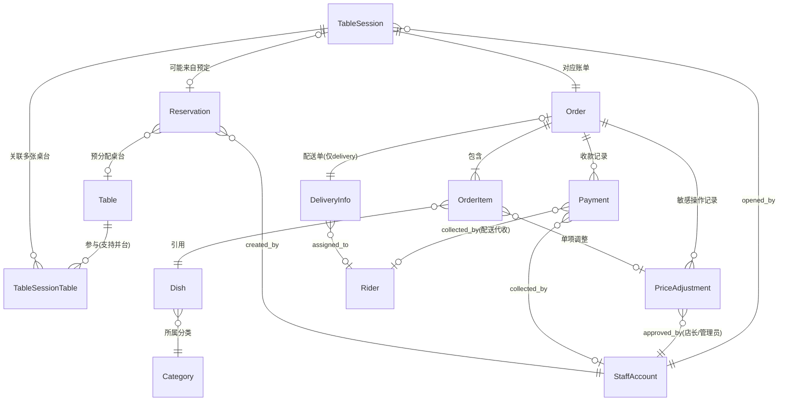

# 餐厅点餐系统 — 数据模型 V1

> 前置阅读：[PRD.md](./PRD.md)、[ARCHITECTURE.md](./ARCHITECTURE.md)
> 本文档记录核心实体、关系及其设计理由。

## 1. 实体关系图

## 2. 实体字段

### Table 桌台

| 字段 | 说明 |
|---|---|
| id | |
| table_number | 桌号，唯一 |
| capacity | 容量 |
| zone | 区域（大厅/包间等），可选 |
| status | `idle` 空闲 / `occupied` 占用 / `pending_clear` 待清台 |

### TableSession 桌台会话

代表一次"开台到清台"的完整周期，与 `Table` 本体解耦。

| 字段 | 说明 |
|---|---|
| id | |
| party_size | 人数 |
| status | `open` 进行中 / `pending_checkout` 待结账 / `closed` 已关闭 |
| opened_by | 开台店员，关联 `StaffAccount` |
| opened_at / closed_at | |
| reservation_id | 可空，若由预定到店开台则关联 |

### TableSessionTable 会话-桌台关联表

支持并台：一个 `TableSession` 可关联多张 `Table`。

| 字段 | 说明 |
|---|---|
| session_id | |
| table_id | |

### Order 订单 / 账单

一次结账单元。堂食场景下与 `TableSession` 一一对应；外卖/自提/配送场景下独立存在，无 `table_session_id`。

| 字段 | 说明 |
|---|---|
| id | |
| type | `dine_in` / `takeout` / `delivery` |
| table_session_id | 可空，仅堂食有值 |
| status | `open` 可继续加菜 / `awaiting_payment` 待结账 / `paid` 已结账 / `cancelled` 已取消 |
| subtotal / discount_total / total | 金额 |
| created_by_type / created_by_id | 下单发起人：`customer`（顾客自助）或 `staff`（店员代客），后者关联 `StaffAccount` |
| customer_contact | 外卖/自提场景的联系电话 |
| pickup_time | 自提场景的预约取餐时间，可空 |
| created_at | |

### OrderItem 订单项

| 字段 | 说明 |
|---|---|
| id | |
| order_id | |
| dish_id | 关联 `Dish` |
| dish_name_snapshot / unit_price_snapshot | 下单时的名称与单价快照，避免菜单后续改价影响历史订单 |
| quantity | |
| notes | 自由文本备注（如"不要香菜"），V1 不做结构化规格/做法变体 |
| kitchen_status | `pending` 待处理 / `preparing` 制作中 / `done` 已完成 —— 精确到菜品项，因为同一批菜里不同菜出品时间不同 |
| round_number | 第几轮追加点餐，用于厨房分批打印/显示 |
| is_voided | 是否已作废 |
| added_by_type / added_by_id | 谁加的这道菜：`customer` 或 `staff` |
| created_at | |

### Dish 菜品 / Category 分类

| 字段（Dish） | 说明 |
|---|---|
| id / category_id / name / price / description / image_url | 基础菜品信息 |
| is_available | 是否可售（售罄/临时下架开关，**不是**库存数量管理） |
| sort_order | 排序 |

| 字段（Category） | 说明 |
|---|---|
| id / name / sort_order | |

### StaffAccount 员工账号

| 字段 | 说明 |
|---|---|
| id / name | |
| login_credential | 登录凭证（PIN 码或工号+密码，具体方式见 ARCHITECTURE.md 待定事项） |
| role | `staff` 普通店员 / `manager` 店长-管理员 |
| status | `active` / `inactive` |

### Rider 配送员

| 字段 | 说明 |
|---|---|
| id / name / login_credential / status | 同 StaffAccount 结构，独立账号体系 |

### DeliveryInfo 配送单（仅 `Order.type = delivery`）

| 字段 | 说明 |
|---|---|
| order_id | 与 Order 一一对应 |
| address / contact_phone | |
| rider_id | 可空，分配后填入 |
| status | `unassigned` / `assigned` / `picked_up` / `delivering` / `delivered` |
| cod_amount | 应收金额（货到付款） |
| payment_confirmed | 骑手是否已确认收款 |
| confirmed_at | |

### Payment 收款记录

| 字段 | 说明 |
|---|---|
| id / order_id | |
| method | `cash` 现金 / `staff_qr` 店员扫码枪收款 / `rider_cod` 骑手代收 等 |
| amount | |
| collected_by_type / collected_by_id | `staff` 或 `rider` |
| collected_at | |

> V1 不支持一笔订单拆分多笔收款（拆账/AA），`Order` 与 `Payment` 按 1 : 1 使用，`Payment` 建模为一对多只是为预留扩展空间，不代表 V1 会用到多条记录。

### PriceAdjustment 敏感操作记录

订单级改价、打折、赠菜、作废的审计留痕，只能由 `role = manager` 的账号产生。

| 字段 | 说明 |
|---|---|
| id / order_id | |
| order_item_id | 可空：为空表示整单调整（如打折），有值表示单项调整（如赠菜/作废某道菜） |
| type | `discount` 打折 / `comp` 赠送 / `void` 作废 / `price_override` 改价 |
| amount | 调整金额或折扣率 |
| reason | 操作原因备注 |
| approved_by | 关联 `StaffAccount`，必须是 `manager` 角色 |
| created_at | |

### Reservation 预定

| 字段 | 说明 |
|---|---|
| id | |
| customer_name / phone / party_size | |
| reserved_time | 预定到店时间 |
| table_id | 可空，可预先指定桌台，也可到店后再分配 |
| status | `pending` 待到店 / `arrived` 已到店 / `cancelled` 已取消 / `no_show` 未到 |
| note | |
| created_by | 关联 `StaffAccount` |
| created_at / arrived_at | |

> 到店开台后与 `TableSession` 的关联，外键实际落在 `TableSession.reservation_id`（见上文 TableSession 定义），`Reservation` 侧没有单独的 `session_id` 字段，通过反向关系查询。

### StoreConfig 门店能力配置

单店部署下是固定单行（id 恒为 1），决定这份部署要不要暴露厨房看板 / 外卖 / 预定这几个可选模块。见 [ARCHITECTURE.md](./ARCHITECTURE.md) 2.7"产品化：用运行时配置覆盖客户差异"。

| 字段 | 说明 |
|---|---|
| id | 恒为 1 |
| kds_screen_enabled | 是否启用厨房电子看板 |
| delivery_enabled | 是否启用外卖/配送模块 |
| reservation_enabled | 是否启用预定模块 |
| updated_at | |

> 桌台平板 vs 顾客自行扫码不需要开关——两者是同一套代码的同一个入口，纯属客户硬件采购决策。打印机相关的配置（打印站点、路由规则）尚未设计，见 ARCHITECTURE.md 2.7"暂缓的部分"。

## 3. 关键设计决策

### 3.1 `Order`（账单）与 `OrderItem.round_number`（下单批次）拆开，厨房状态精确到菜品项

**决策**：一次结账对应一个 `Order`，但同一个 `Order` 下的 `OrderItem` 可以来自多轮追加点餐（用 `round_number` 区分），厨房状态 `kitchen_status` 记在每个 `OrderItem` 上，而不是整单一个状态。

**理由**：堂食场景支持同一桌多次追加点餐，但结账是整桌一次性结的——如果订单和账单是同一个粒度，"这一轮点的菜做完了没"和"这一桌一共该收多少钱"就没法分开追踪。同一批里凉菜先出、热菜后出是常态，状态必须精确到菜品项。

### 3.2 `TableSession` 独立于 `Table`，通过 `TableSessionTable` 支持并台

**决策**：`TableSession` 不是 `Table` 的一个字段，而是独立实体；一个会话可以通过关联表对应多张桌台。

**理由**：同一张桌子一天内会翻台多次，`TableSession` 独立建模能让每次入座的历史记录互不覆盖；并台需求（多张桌台合并为一桌服务）直接建模为"多张 `Table` 关联同一个 `TableSession`"，厨房和收银按会话而非按桌台处理，不需要额外的合并/拆分逻辑。

### 3.3 `PriceAdjustment` 审计记录

**决策**：改价、打折、赠菜、作废都写入 `PriceAdjustment`，绑定 `approved_by`（必须是店长/管理员账号）。

**理由**：这是 ARCHITECTURE.md 中"权限分级"决策在数据层的落地——如果不记录谁在什么时间做了敏感操作，权限分级规则就只是摆设，出现账目纠纷时无法查证。

### 3.4 `Dish.is_available` 是可售开关，不是库存管理

**决策**：`Dish` 只有一个布尔开关表示当前是否可点，没有库存数量字段。

**理由**：PRD 中已明确排除完整的库存/供应链系统，但"卖完了，先别让人点"是几乎所有餐饮场景的基础需求，成本很低，因此保留一个简单开关，不引入数量追踪、扣减、预警等库存管理逻辑。

### 3.5 预定到点提醒：系统内高亮，非外部通知

**假设**：`Reservation` 的"到点提醒"通过前台/管理后台界面上的高亮或置顶实现（预定时间临近时该条记录视觉上突出），不通过短信/推送等外部渠道通知顾客或店员的手机。

**理由**：项目目前没有短信网关或推送服务这类外部通信基础设施，引入短信提醒属于新的范围，需要额外的技术选型（短信服务商、发送成本）和产品决策（提醒时机、文案），V1 先用系统内提示覆盖"店员该注意有客人快到了"这个核心需求。

## 4. 待确认/待细化事项

- ~~员工登录鉴权具体方式~~ 已定为 PIN 码，见 ARCHITECTURE.md
- ~~`round_number` 的具体触发规则~~ 已在脚手架搭建时定案：`OrderItem` 加一个 `submittedAt`（可空）字段，加菜时 `roundNumber = 0` 且 `submittedAt = null`（代表"未提交的购物车"），调用 `/orders/:id/submit` 时统一把当前所有未提交项分配下一个 `roundNumber` 并写入 `submittedAt`，推送厨房。schema.prisma 已按此实现。
- **新发现的缺口**：外卖/自提订单目前只支持店员在前台代客创建（POS 场景）。PRD 里"顾客线上下单外卖/自提"这条路径还没有对应的顾客身份/令牌模型——现有的 guest session token 是绑定 `table_session_id` 的堂食专属身份，不能直接套用到外卖/自提。这是下一阶段需要单独设计的点：顾客在店外下单，如何标识"这是同一个顾客"、如何查询订单状态。
- 报表所需的统计口径（营业额、菜品销量排行等）尚未设计，待后续单独讨论
